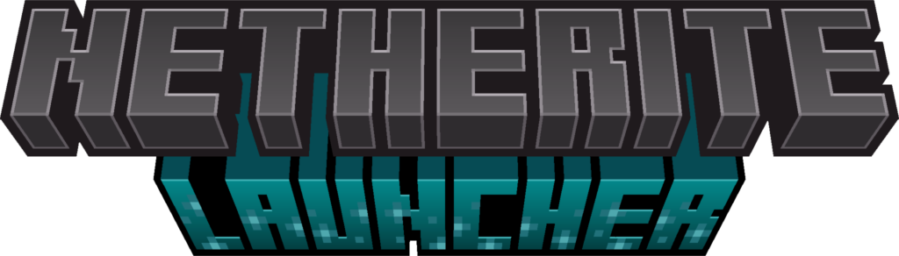

 

<b>Netherite Launcher</b> is a custom launcher that allows you to launch Minecraft Java Edition and Bedrock Edition, it has easy mod handling support and 3rd party tool support while keeping the look and feel of the offical launcher.

Netherite Launcher is <b>not</b> a offical Minecraft product.

<h1 align="center">~~ Coming Soon ~~</h1>
